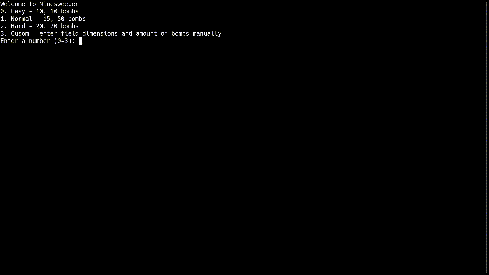
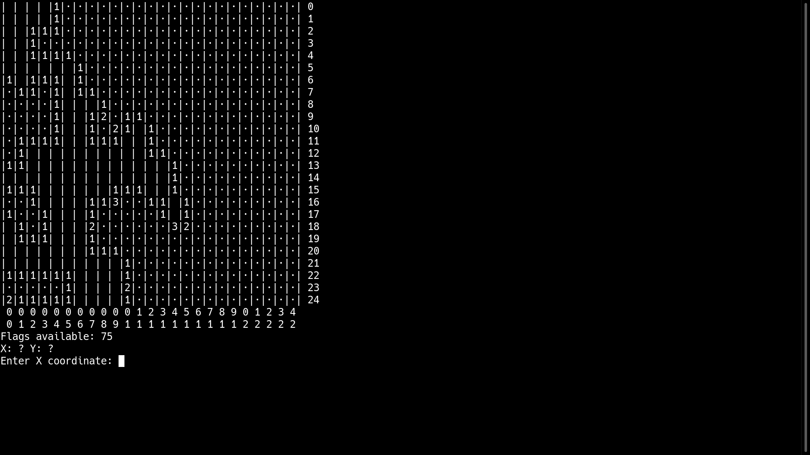
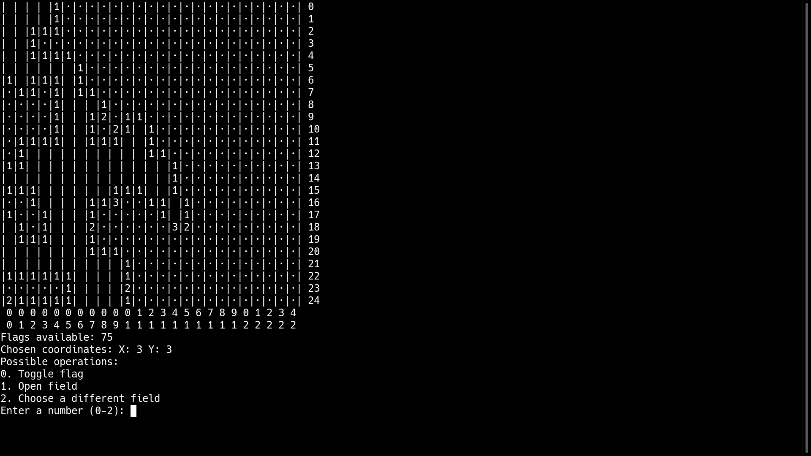

Minesweeper written in C++ with no GUI
## How to run
```
g++ minesweeper.cpp -o minesweeper
./minesweeper
```
## Difficulties 
You can modify the presets in minesweeper.cpp in the define statements
```
#define easy_field_size 10
#define easy_bomb_amount 10
#define normal_field_size 15
#define normal_bomb_amount 50
#define hard_field_size 20
#define hard_bomb_amount 20
```
Mind that all preset fields are squares so only one length is required
## Gameplay

## Screenshots



